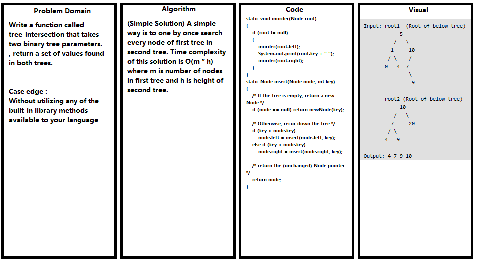

# Challenge Summary
Find common values in 2 binary trees.

## Challenge Description
1. Write a function called tree_intersection that takes two binary tree parameters.
2. Without utilizing any of the built-in library methods available to your language, return a set of values found in both trees.

## Approach & Efficiency
Method 1 (Simple Solution) A simple way is to one by once search every node of first tree in second tree. Time complexity of this solution is O(m * h) where m is number of nodes in first tree and h is height of second tree.

Method 2 (Linear Time) We can find common elements in O(n) time.
1) Do inorder traversal of first tree and store the traversal in an auxiliary array ar1[].
2) Do inorder traversal of second tree and store the traversal in an auxiliary array ar2[]
3) Find intersection of ar1[] and ar2[].

Time complexity of this method is O(m+n) where m and n are number of nodes in first and second tree respectively. This solution requires O(m+n) extra space.

Method 3 (Linear Time and limited Extra Space) We can find common elements in O(n) time and O(h1 + h2) extra space where h1 and h2 are heights of first and second BSTs respectively.
The idea is to use iterative inorder traversal. We use two auxiliary stacks for two BSTs. Since we need to find common elements, whenever we get same element, we print it.

language used : Java

## Solution

